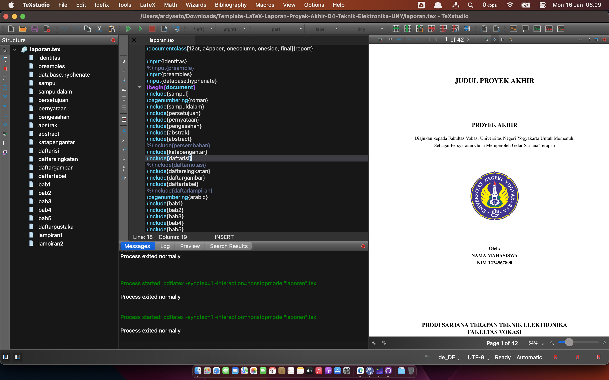

# 📘 Template LaTeX Laporan Praktik Industri

**Program Sarjana Terapan Teknik Elektronika — Fakultas Vokasi UNY**

Repositori ini menyediakan **template LaTeX resmi** untuk penulisan **Laporan Praktik Industri** bagi mahasiswa Program Sarjana Terapan Teknik Elektronika, Fakultas Vokasi, Universitas Negeri Yogyakarta (UNY).
Template ini dirancang agar penulisan laporan menjadi lebih **terstruktur**, **konsisten**, dan **efisien**, dengan dukungan dokumentasi, format terstandar, dan kemudahan pengelolaan file melalui GitHub.

---

## 📂 Struktur Folder

```
.
├── LICENSE                      # Lisensi proyek (MIT)
├── Project
│   ├── a0-identitas.tex         # Identitas mahasiswa dan laporan (judul, nama, dosen pembimbing, dll)
│   ├── a1-database.hyphenate.tex # Pengaturan pemenggalan kata
│   ├── a2-katapengantar.tex     # Kata pengantar laporan
│   ├── a3-lampiran.tex          # Daftar lampiran (edit sesuai kebutuhan)
│   ├── b1-bab1.tex              # BAB 1 - Pendahuluan
│   ├── b2-bab2.tex              # BAB 2 - Tinjauan Pustaka
│   ├── b3-bab3.tex              # BAB 3 - Metodologi
│   ├── b4-bab4.tex              # BAB 4 - Hasil dan Pembahasan
│   ├── b5-bab5.tex              # BAB 5 - Penutup
│   ├── gambar/                  # Gambar laporan
│   ├── kode/                    # Kode program pendukung
│   ├── laporan-pi.tex           # File utama kompilasi (jangan diedit langsung)
│   ├── laporan-pi.pdf           # Contoh hasil kompilasi (PDF)
│   ├── pustaka.bib              # Daftar pustaka (format BibTeX)
│   └── untouch/                 # Komponen penting LaTeX (jangan diedit)
│       ├── xx-daftar.tex
│       ├── xx-daftarpustaka.tex
│       ├── xx-pengesahan.tex
│       ├── xx-preambles.tex
│       └── xx-sampul.tex
└── README.md                    # Dokumentasi ini 

```

---

## 🛠️ Persiapan & Instalasi

### 1. Instalasi MikTeX dan TeXstudio

* **MikTeX**: [https://miktex.org/download](https://miktex.org/download)

  > Pastikan memilih opsi **for all users** dan **Always install** pada on-the-fly installation.
* **TeXstudio**: [https://www.texstudio.org](https://www.texstudio.org)

### 2. Update MikTeX Packages

Buka **MikTeX Console**, lalu jalankan perintah **Update All** untuk memastikan semua paket terinstal.

### 3. Unduh Template

* Klik tombol **Code > Download ZIP** atau gunakan:

  ```bash
  git clone https://github.com/username/template-latex-laporan-pi-uny.git
  ```

---

## ✍️ Langkah Penggunaan

1. **Buka file `laporan-pi.tex`** di TeXstudio (jangan diedit langsung).
2. **Edit file berikut sesuai kebutuhan:**

   * `a0-identitas.tex` → Judul, nama, NIM, dosen pembimbing.
   * `a2-katapengantar.tex` → Kata pengantar laporan.
   * `b1-bab1.tex` s.d. `b5-bab5.tex` → Konten masing-masing bab laporan.
   * `a3-lampiran.tex` → Tambahkan daftar lampiran.
   * `pustaka.bib` → Tambahkan daftar referensi (gunakan Mendeley/Zotero/JabRef).
3. Klik tombol **Build & View** di TeXstudio untuk menghasilkan laporan dalam bentuk PDF (`laporan-pi.pdf`).

---

## 📺 Video Tutorial

| Materi                                 | Link                                       |
| -------------------------------------- | ------------------------------------------ |
| Tutorial 1 - Dasar Penggunaan Template | [🎥 YouTube](https://youtu.be/lnPTVrOGB90) |
| Tutorial 2 - Penulisan Isi             | [🎥 YouTube](https://youtu.be/4Qk_2pknhsM) |
| Tutorial 3 - Gambar & Tabel            | [🎥 YouTube](https://youtu.be/oxY1mbZgv94) |
| Tutorial 4 - Referensi & Sitasi        | [🎥 YouTube](https://youtu.be/goq-IS4WJW4) |
| Tutorial 5 - Penulisan Kode Program    | [🎥 YouTube](https://youtu.be/JeSJ0mYfxA0) |
| Workshop Lengkap                       | [🎥 YouTube](https://youtu.be/anMLRydjDOE) |

---

## 📚 Manajemen Referensi

Disarankan menggunakan:

* [Mendeley](https://www.mendeley.com/)
* [Zotero](https://www.zotero.org/)
* [JabRef](https://www.jabref.org/)

Untuk mengelola referensi dan menghasilkan file `.bib`.

---

## 🖼️ Tampilan Editor

| TeXstudio - macOS                                     | TeXstudio - Windows                                     |
| ----------------------------------------------------- | ------------------------------------------------------- |
|  |  |

---

## 📄 Lisensi

Template ini dilisensikan di bawah [MIT License](LICENSE).

---

## 🤝 Kontribusi

Silakan kontribusikan saran atau perbaikan melalui:

* **Pull Request**
* **Issues**

---

## 📬 Kontak

📧 [ardyseto@uny.ac.id](mailto:ardyseto@uny.ac.id)
👤 [@2black0](https://github.com/2black0)

---