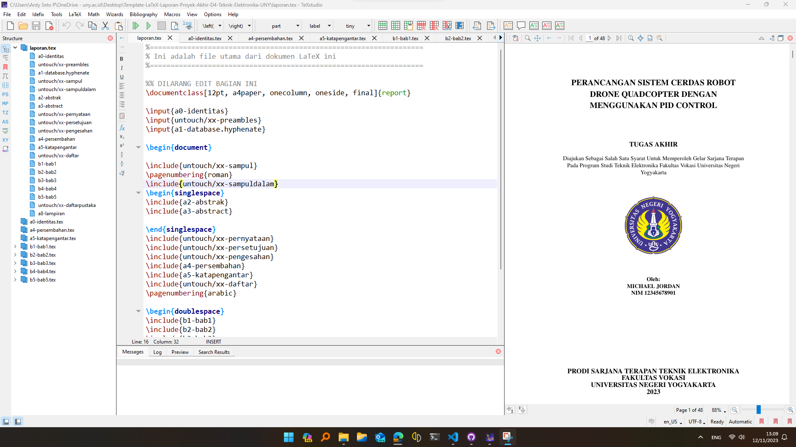

# Template LaTeX Laporan Praktik Industri Mahasiswa Sarjana Terapan Teknik Elektronika FV UNY

Repo ini berisi template LaTeX yang digunakan dalam penulisan Laporan Praktik Industri Mahasiswa Sarjana Terapan Teknik Elektronika FV UNY. Semua Mahasiswa Sarjana Terapan Teknik Elektronika FV UNY wajib menggunakan template LaTeX ini karena dengan menggunakan template ini penulisan laporan akan menjadi lebih cepat dengan format yang seragam sehingga mahasiswa dapat fokus pada konten dan tidak terkendala dengan format laporan yang kadang kala menjadi kendala tersendiri. Selain itu penyimpanan file laporan menjadi lebih mudah karena dapat di simpan di Github sehingga mudah untuk diakses.

## Catatan Perubahan

- 16 November 2023: Pembuatan template dari Laporan Praktik Industri

## Penjelasan Isi File

Clone repo ini dengan menggunakan git clone atau unduh dengan klik Download Zip yang ada di pojok kanan atas dari repo ini. Terdapat beberapa file dalam repo ini, dan berikut adalah penjelasan dari masing-masing file:

        .
        ├──a0-identitas.tex            # file pertama yang harus diedit berisi identitas dari tugas akhir seperti judul, nama mahasiswa, dll
        ├──a1-database.hyphenate.tex   # berisi daftar kata yang perlu dipenggal
        ├──a2-katapengantar.tex        # kata pengantar, edit sesuai kebutuhan
        ├──a3-lampiran.tex             # daftar lampiran, edit sesuai dengan kebutuhan
        ├──b1-bab1.tex                 # bab 1
        ├──b2-bab2.tex                 # bab 2
        ├──b3-bab3.tex                 # bab 3
        ├──b4-bab4.tex                 # bab 4
        ├──laporan.pdf                 # file laporan dalam format pdf
        ├──laporan.tex                 # file utama, jangan edit file ini 
        ├──README.md                   # file yang sedang anda baca
        ├──pustaka.bib                 # daftar referensi dalam format bib, untuk menggenerate bagian ini gunakan mendeley / zotero
        ├──untouch                     # folder berisi file yang tidak boleh diedit 
                xx-daftar.tex               
                xx-daftarpustaka.tex        
                xx-pengesahan.tex                
                xx-preambles.tex            
                xx-sampul.tex               
        ├──gambar                      # folder berisi gambar, copy gambar yang dimasukkan pada laporan kesini dalam format jpg/png
               gambar-kucing.jpg
               logo-uny.png
               screenshot-miktex.png
               screenshot-texstudio.png
        ├──kode                         # folder berisi kode program, simpan dengan format sesuai dengan bahasa pemrograman yang digunakan
               code_sample.cpp
               code_sample.ino
               code_sample.java
               code_sample.py

file yang diawali dengan nama xx- terlarang untuk diedit selain itu silahkan edit sesuai dengan kebutuhan.

## Video Tutorial
1. Tutorial LaTeX 1 - Penggunaan Template untuk Penulisan Laporan Tugas Akhir D4 Teknik Elektronika UNY

1. Tutorial LaTeX 2 - Penulisan Isi pada Template LaTeX

1. Tutorial Latex 3 - Penambahan Gambar dan Tabel

1. Tutorial LaTeX 4 - Pembuatan Daftar Pustaka dan Sitasi

## Petunjuk Penggunaan
1. Unduh dan Install MikTeX (https://miktex.org/download) sebagai distribusi dari LaTeX (pilih sesuai sistem operasi yang digunakan), catatan bagi pengguna Windows **Wajib Memilih for All User** saat proses instalasi serta pilih opsi _Always_ pada Installed on-the-fly
2. Unduh dan Install TeXstudio (https://www.texstudio.org/) sebagai editor untuk Sistem Operasi Windows, MacOS atau Linux
3. Sebelum unduh repo ini pastikan telah mengupdate semua paket yang ada pada MikTex Console kemudian unduh Repo ini dan extract, kemudian Open _laporan.tex_ pada TexStudio
4. Pada sisi kiri terdapat daftar file yang berada dalam folder kemudian edit file sesuai dengan kebutuhan
5. Terdapat beberapa contoh dalam _laporan.tex_ yang dapat dibaca pada _laporan.pdf_ seperti memasukkan gambar, membuat tabel, menuliskan persamaan, menuliskan sumber kode, dan membuat referensi dan sitasi
6. Pastikan komputer sudah terhubung dengan internet karena diperlukan beberapa paket yang diunduh secara otomatis, kemudian setelah semua selesai bisa klik tombol **build & view** maka dokumen LaTeX akan digenerate dan outputnya adalah _laporan.pdf_ yang berada di sisi kanan

## Pembuatan isi file bib (bibliography)
Pembuatan isi file bib (bibliography) dapat dilakukan dengan software Mendeley (https://www.mendeley.com/search/) atau Zotero (https://www.zotero.org/). Selain itu sangat direkomendasikan menggunakan JabRef (https://www.jabref.org/).

## Screenshot

## Catatan
Apabila ada pertanyaan dan konsultasi terkait template ini bisa tanyakan lewat email ke ardyseto@uny.ac.id

## Pengembang

- [@2black0](https://www.github.com/2black0)

